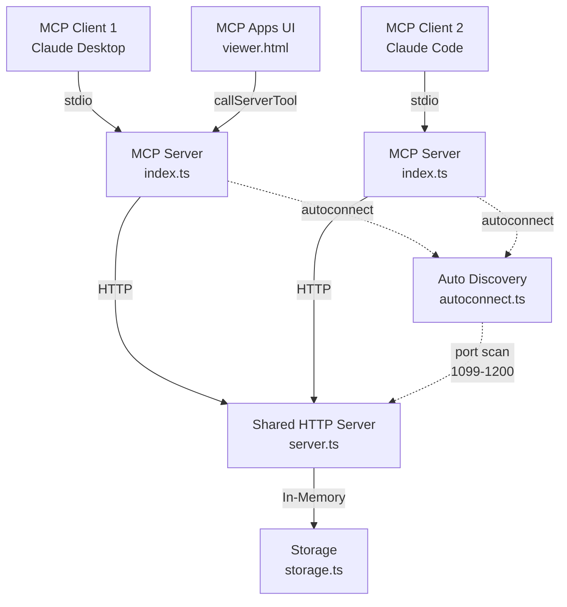

# 開発ルール

---

## 調査レポートの保存

WebFetchや外部調査を行った際は調査結果を保存する
調査レポートはテンプレート構造に従う

- テンプレート: ./.claude/research/template.md
- 保存先: ./.claude/research/YYYY-MM-DD_調査タイトル.md

---

## プロジェクト概要

### 基本情報

- **アプリケーション名**: conversation-handoff-mcp
- **プロジェクトタイプ**: MCPサーバー（npmパッケージ）

### ミッション

AIチャット間（Claude Desktop ↔ Claude Code 等）や、同AI内の異なるプロジェクト間で会話コンテキストを引き継ぐ。手動コピペなしで、設計議論の文脈を実装作業にシームレスに持ち込める。

### ターゲットユーザー

MCPクライアント（Claude Desktop, Claude Code, Codex CLI, Gemini CLI, Cursor 等）を使うAI開発者。複数のAIセッション間でコンテキストの断絶に課題を感じている人。

### アーキテクチャ図

**実態に合わせて都度更新**



### ドメイン知識と制約

- MCP（Model Context Protocol）はAIクライアント-サーバー間のstdio通信規約
- MCP Apps UIは`@modelcontextprotocol/ext-apps`による拡張UIで、対応クライアントでのみ表示
- ストレージはメモリベース（サーバー終了でデータ消失）。軽量な一時クリップボード設計
- handoff_loadの出力にはプロンプトインジェクション対策のセキュリティマーカーを含む

---

## 開発コマンド

```bash
npm run build      # UIビルド + TypeScriptコンパイル
npm run dev        # TypeScript watchモード
npm run test       # テスト実行
npm run check      # Biome lint + format チェック
npm run check:fix  # 自動修正
npm run typecheck  # 型チェック
```

## ディレクトリ構成

```
src/
├── index.ts       # MCPサーバー本体、ツール定義
├── storage.ts     # LocalStorage / RemoteStorage
├── server.ts      # HTTPサーバー（共有モード用）
├── autoconnect.ts # 自動接続・再接続ロジック
├── validation.ts  # 入力バリデーション
└── audit.ts       # 構造化監査ログ（--audit モード）

ui/
├── viewer.html    # MCP Apps UI（エントリポイント）
└── viewer.ts      # UI実装
```

## MCP Apps UI

- `handoff_list`が`registerAppTool`で登録され、対応クライアントでUI表示
- UIは`ontoolresult`で`structuredContent`からデータを受信
- `callServerTool({ name: "ツール名", arguments: {} })`でサーバーツール呼び出し可能
- UIは`vite-plugin-singlefile`で単一HTMLにバンドル: `npm run build:ui` → `dist/ui/viewer.html`

## テスト

```bash
npm run test           # 全テスト
npm run test:watch     # watchモード
npm run test:coverage  # カバレッジ
```

## リリース

1. `package.json`のバージョン更新
2. `CHANGELOG.md`更新
3. `README.md` / `README.ja.md`更新（新機能の説明追加）
4. feature branch → `main`へPR作成・マージ
5. `npm publish`
6. [Glama.ai](https://glama.ai/mcp/servers/@trust-delta/conversation-handoff-mcp)で「Sync server」を実行（自動更新されないため）
